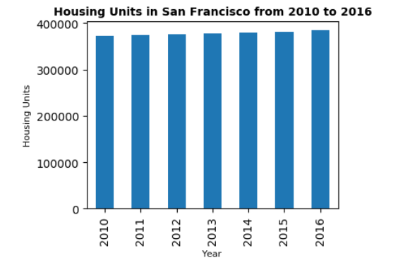

# Rental_Analysis_Pyviz


*[San Francisco Park Reading by Juan Salamanca](https://www.pexels.com/photo/park-san-francisco-reading-61109/) | [Free License](https://www.pexels.com/photo-license/)*

## Background

Harold's company has just started a new Real Estate Investment division to provide customers with a broader range of portfolio options. Harold was tasked with building a prototype dashboard and he needs your help. The real estate team wants to trial this initial offering with investment opportunities for the San Francisco market. If the new service is popular, then they can start to expand to other markets.

The goal of this dashboard is to provide charts, maps, and interactive visualizations that help customers explore the data and determine if they want to invest in rental properties in San Francisco.


## Packages

* Hvplot
* Plotly Express
* Mapbox Token
* Panel - Dashboard

## Files

* [sfo_neighborhoods_census_data.csv](Starter_Code/Data/sfo_neighborhoods_census_data.csv)
* [neighborhoods_coordinates.csv](Starter_Code/Data/neighborhoods_coordinates.csv)
* [Rental Analysis Starter Jupyter Notebook](Starter_Code/rental_analysis.ipynb)
* [Dashboard Starter Jupyter Notebook](Starter_Code/dashboard.ipynb)


### Rental Analysis

The first step to building the dashboard is to work out all of the calculations and visualizations in an analysis notebook. Once the code is worked out here, it can be copied over to a dashboard code and used with Panel to create the final layout. Use the `rental_analysis.ipynb` to complete the following:

#### Housing Units Per Year

Calculate the number of housing units per year and visualize the results as a bar chart using the Pandas plot function.

```
    no_of_housing_unit=sfo_data.groupby('year')['housing_units'].mean()
    no_of_housing_unit.plot.bar()
```

Default Bar Chart

  


By default, the limits auto-scale to the data. However, it is hard to see the difference between the yearly data. So I used the min, max, and standard deviation of the data to manually scale the y limits of the plot.

Bar Chart with y-axis limits adjusted

  


#### Average Gross Rent in San Francisco Per Year

In this section, you want to visualize the average gross rent per year to better understand the trends for rental income over time. You will visualize the average (mean) gross rent per year and visualize it as a line chart.

1. Calculate the mean `gross` for each year.

```
    avg_rent = sfo_data.groupby('year')[['sale_price_sqr_foot','gross_rent']].mean().plot()
```
 
2. Visualize the mean gross rent per year as a line chart.

  

#### Average Sales Price Per Year

Determine the average sales price per year to better understand the sales price of the rental property over time. For example, a customer will want to know if they should expect an increase or decrease in the property value over time so they can determine how long to hold the rental property.

1. Calculate the mean `gross` for each year.

```
    sfo_data.groupby('year')[['sale_price_sqr_foot','gross_rent']].mean().plot()
```

2. Visualize the mean gross rent per year as a line chart.

  

#### Average Prices By Neighborhood

Compare the average prices by neighborhood.

1. Group the data by year and by neighborhood and calculate the average (mean) `sales_price_sqr_foot`.

```
    new_df = sfo_data.groupby(['year', 'neighborhood'])[['sale_price_sqr_foot','housing_units','gross_rent']].mean().reset_index()
    new_df.hvplot(label="Average Price per square foot by year ",
              x='year',
              y='sale_price_sqr_foot',
              xlabel='Year',
              ylabel="Avg Sales Price per Square Foot",
              groupby='neighborhood')
```


2. Visualize the mean `sales_price_sqr_foot` per year with the neighborhood as a dropdown selector. Hint: Use hvplot to obtain the interactive dropdown selector for the neighborhood.

  

#### Top 10 Most Expensive Neighborhoods

Calculate the mean sale price for each neighborhood and then sort the values to obtain the top 10 most expensive neighborhoods on average. Plot the results as a bar chart.

```
    avg_value_neighborhood = new_df.drop(['year'],axis=1).groupby('neighborhood').mean()
    expensive_neighborhood=avg_value_neighborhood.sort_values('sale_price_sqr_foot', ascending=False).head(10)
```

  

#### Parallel Coordinates and Parallel Categories Analysis

Use plotly express to create parallel coordinates and parallel categories visualizations so that investors can interactively filter and explore various factors related to the sales price of the neighborhoods.

Using the DataFrame of Average values per neighborhood (calculated above), create the following visualizations:

1. Create a Parallel Coordinates Plot

  

2. Create a Parallel Categories Plot

  

#### Neighborhood Map

Read in neighborhood location data and build an interactive map with the average prices per neighborhood. Visualization created with the use of scatter mapbox object from plotly express. Mapbox API key is required to visualize this. 

```
    # Calculate the mean values for each neighborhood
    avg_value = new_df.drop(['year'],axis=1).groupby('neighborhood').mean().reset_index()
    avg_value=avg_value.rename(columns = {'neighborhood':'Neighborhood'})
    
    # Join the average values with the neighborhood locations
    combined_df = pd.merge(df_neighborhood_locations,avg_value, on='Neighborhood')
```

  

### Dashboard

Note : For Panel Library, plotly express scatter box & parrellel co-ordinates are not getting reflected. I and my class instructor tried many ways to setup the environment but were not successful. Also, we were not able to run it using 'Bokeh'

Use of the Panel library to build an interactive dashboard for all of the visualizations. 

Create a new `dashboard.ipynb` for your dashboard code. 

##### Steps to execute the Dashboard:

     1. Open terminal
     2. Activate the environment where the packages are installed
     3. Makesure the Mapbox API is added as environment variable
     4. Dashboard Path where Dashboard.ipynb is located
     5. Execute "panel serve --show dashboard.ipynb" to run the file 

Sample Dashboard (Same as Instructions)

  


